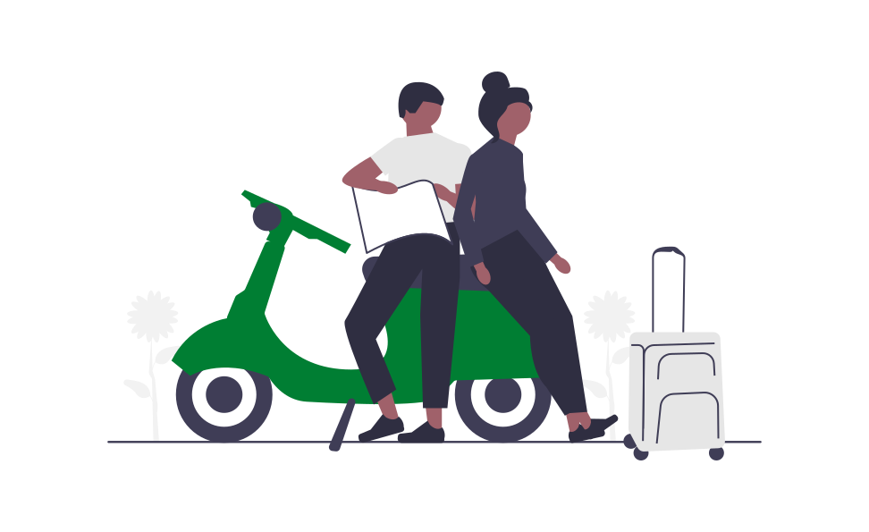

<!-- Improved compatibility of back to top link: See: https://github.com/othneildrew/Best-README-Template/pull/73 -->

<a name="readme-top"></a>

<!--
*** Thanks for checking out the Best-README-Template. If you have a suggestion
*** that would make this better, please fork the repo and create a pull request
*** or simply open an issue with the tag "enhancement".
*** Don't forget to give the project a star!
*** Thanks again! Now go create something AMAZING! :D
-->

<!-- PROJECT SHIELDS -->
<!--
*** I'm using markdown "reference style" links for readability.
*** Reference links are enclosed in brackets [ ] instead of parentheses ( ).
*** See the bottom of this document for the declaration of the reference variables
*** for contributors-url, forks-url, etc. This is an optional, concise syntax you may use.
*** https://www.markdownguide.org/basic-syntax/#reference-style-links
-->

[![Contributors][contributors-shield]][contributors-url]
[![Forks][forks-shield]][forks-url]
[![Stargazers][stars-shield]][stars-url]
[![Issues][issues-shield]][issues-url]

<!-- PROJECT LOGO -->
<br />
<div align="center">
  <a href="https://github.com/GiangHoGoVap/travel-app">
    
  </a>

<h3 align="center" class="js-nav-logo">VNLook</h3>
  <p align="center">
    This is a mini-project for E-commerce course (CO3027)
    <br />
    <a href="#about-the-project">View Demo</a>
    ·
    <a href="https://github.com/GiangHoGoVap/travel-app/issues">Report Bug</a>
    ·
    <a href="https://github.com/GiangHoGoVap/travel-app/pulls">Request Feature</a>
  </p>
</div>

<!-- TABLE OF CONTENTS -->
<details>
  <summary>Table of Contents</summary>
  <ol>
    <li>
      <a href="#about-the-project">About The Project</a>
      <ul>
        <li><a href="#built-with">Built With</a></li>
      </ul>
    </li>
    <li>
      <a href="#getting-started">Getting Started</a>
      <ul>
        <li><a href="#prerequisites">Prerequisites</a></li>
      </ul>
    </li>
    <li><a href="#usage">Usage</a></li>
    <li><a href="#contributing">Contributing</a></li>
    <li><a href="#contact">Contact</a></li>
  </ol>
</details>

<!-- ABOUT THE PROJECT -->

## About The Project

<div align="center">
<video width="50%" controls autoplay>
  <source src="movie.mp4" type="video/mp4">
</video>
</div>

### Built With

-   [![ReactNative][reactnative.dev]][reactnative-url]
-   [![Redux][redux.js.org]][redux-url]
-   [![Stripe][stripe.com]][stripe-url]

<!-- GETTING STARTED -->

## Getting Started

This is a mobile travel app supporting online ticket purchases that we use <strong>React Native</strong> to create the UI, <strong>Stripe</strong> for payment processing and interaction with the database by <strong>Sanity</strong> - Headless CMS.

### Prerequisites

For convenience, I recommend you read [React Native docs](https://reactnative.dev/docs/environment-setup) about how to set up the environment to run the localhost, [Stripe docs](https://stripe.com/docs/testing) about how to stimulate payment for testing. <br>
To run this project, install all the dependencies required:

```sh
npm install
```

<!-- USAGE EXAMPLES -->

## Usage

This project is built from scratch so you can easily customize your own website.

_For more discussions about this project, please send me [mail](mailto:minhtam27022001@gmail.com)_

<!-- CONTRIBUTING -->

## Contributing

If you have a suggestion that would make this better, please fork the repo and create a pull request. You can also simply open an issue with the tag "enhancement".
Don't forget to give the project a star! Thanks again!

1. Fork the Project
2. Create your Feature Branch (`git checkout -b feature/AmazingFeature`)
3. Commit your Changes (`git commit -m 'Add some AmazingFeature'`)
4. Push to the Branch (`git push origin feature/AmazingFeature`)
5. Open a Pull Request

<!-- CONTACT -->

## Contact

Tam Nguyen - <a href="mailto:minhtam27022001@gmail.com?" target="blank"></a>

Project Link: [https://github.com/GiangHoGoVap/travel-app](https://github.com/GiangHoGoVap/travel-app)

<p align="right">(<a href="#top">back to top</a>)</p>

<!-- MARKDOWN LINKS & IMAGES -->
<!-- https://www.markdownguide.org/basic-syntax/#reference-style-links -->

[contributors-shield]: https://img.shields.io/github/contributors/GiangHoGoVap/travel-app.svg?style=for-the-badge
[contributors-url]: https://github.com/GiangHoGoVap/travel-app/graphs/contributors
[forks-shield]: https://img.shields.io/github/forks/GiangHoGoVap/travel-app.svg?style=for-the-badge
[forks-url]: https://github.com/GiangHoGoVap/travel-app/network/members
[stars-shield]: https://img.shields.io/github/stars/GiangHoGoVap/travel-app.svg?style=for-the-badge
[stars-url]: https://github.com/GiangHoGoVap/travel-app/stargazers
[issues-shield]: https://img.shields.io/github/issues/GiangHoGoVap/travel-app.svg?style=for-the-badge
[issues-url]: https://github.com/GiangHoGoVap/travel-app/issues
[reactnative.dev]: https://img.shields.io/badge/React_Native-20232A?style=for-the-badge&logo=react&logoColor=61DAFB
[reactnative-url]: https://reactnative.dev/
[redux.js.org]: https://img.shields.io/badge/Redux-593D88?style=for-the-badge&logo=redux&logoColor=white
[redux-url]: https://redux.js.org/
[stripe.com]: https://img.shields.io/badge/Stripe-626CD9?style=for-the-badge&logo=Stripe&logoColor=white
[stripe-url]: https://stripe.com/